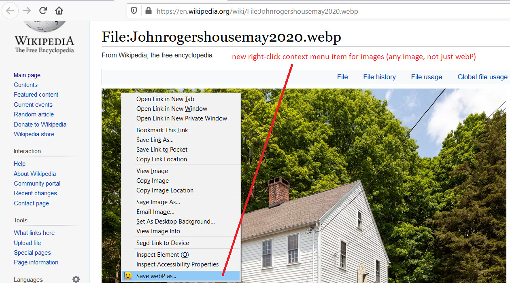
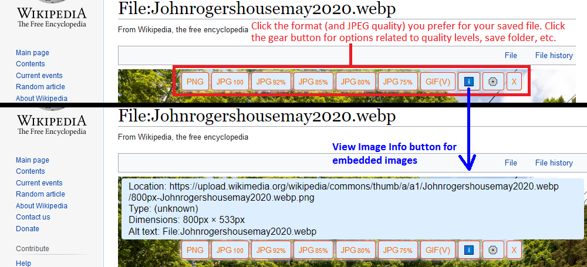

# Save-webP-as-extension
Firefox extension to overlay format and JPEG quality buttons on inline or stand-alone images for quickly saving a converted version of the image.

URL on AMO: https://addons.mozilla.org/firefox/addon/save-webp-as-png-or-jpeg/

**Screenshots:**

