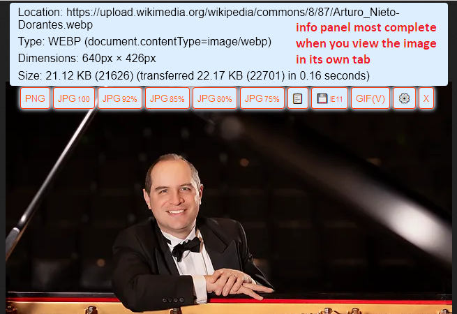

# Save-webP-as-extension
Firefox extension to overlay format and JPEG quality buttons on inline or stand-alone images for quickly saving a converted version of the image.

URL on AMO: https://addons.mozilla.org/firefox/addon/save-webp-as-png-or-jpeg/

**Screenshots:**

You can remove unwanted Save/Copy/Re-request buttons on the Options page (click the gear button):

When an image is displayed stand-alone, the bar and the info panel appear automatically for WebP images:

